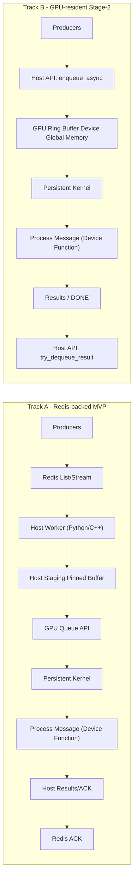

# GPUQueue (CUDA Message Queue) — Scaffold

This repository contains a scaffold for a CUDA-backed, GPU-resident message queue with a Python API.

- Build system: scikit-build-core + CMake + PyBind11 + CUDA
- Python package: `gpuqueue`
- Target: Linux x86_64, Python 3.10–3.12, CUDA 12.6+, RTX 4070 Ti Super (sm_89)

## Layout
```
src/
  python/gpuqueue/        # Python package
  cpp/                    # C++ sources and PyBind11 bindings
  cuda/                   # CUDA kernels
include/gpuqueue/         # Public C++ headers
```

## Architecture



See `docs/design.md` and `docs/api.md` for detailed semantics and synchronization.

## Quickstart (build locally)

Prereqs: Python 3.10+, CUDA Toolkit (nvcc), CMake ≥3.24, Ninja ≥1.11

```bash
python -m pip install -U pip
python -m pip install -e .
python -c "import gpuqueue as gq; print(gq.__version__); print(gq.core_version() if gq.core_version else 'no core')"
```

Notes:
- The core currently exposes `init()`, `shutdown()`, and `version()` from the `_core` extension.
- See `docs/packaging.md` for packaging and CI details.

