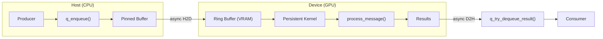

# GPUQueue — CUDA GPU-Resident Message Queue

A high-performance, GPU-resident message queue with Python bindings. Messages are enqueued from the host, processed by a persistent CUDA kernel, and results returned — all with minimal PCIe round-trips.

[](https://github.com/Flameingmoy/GPGPU_in-mem_msg_q/actions/workflows/ci.yml)
[](https://www.gnu.org/licenses/gpl-3.0)
[](https://developer.nvidia.com/cuda-toolkit)
[](https://www.python.org/)

## Features

- **GPU-Resident Queue**: Ring buffer lives in VRAM, processed by persistent kernel
- **Low Latency**: Avoid repeated kernel launch overhead with persistent kernel pattern
- **Correct Synchronization**: CUDA atomics + memory fences (`__threadfence`, `__threadfence_system`)
- **Python API**: Simple `enqueue()` / `dequeue()` interface via pybind11
- **High Throughput**: Batch enqueue, async transfers, multi-stream pipelining

## Requirements

| Component | Version |
|-----------|---------|
| **OS** | Linux x86_64 (Ubuntu 22.04/24.04 tested) |
| **GPU** | NVIDIA GPU with Compute Capability ≥7.0 (tested on RTX 4070 Ti Super, sm_89) |
| **CUDA Toolkit** | 12.6+ |
| **Driver** | ≥535 |
| **Python** | 3.10–3.12 |
| **CMake** | ≥3.24 |

## Project Status

| Milestone | Status | Description |
|-----------|--------|-------------|
| M0 | ✅ Complete | Documentation foundations |
| M1 | ✅ Complete | Environment & build verification |
| M2 | ✅ Complete | Ring buffer & persistent kernel |
| M3 | ✅ Complete | Redis-backed MVP (Track A validation) |
| M4 | ✅ Complete | Python API & packaging |
| M5 | ✅ Complete | Testing, benchmarking, soak tests |
| M6 | ✅ Complete | CI/CD, release workflows, documentation |

### Performance Comparison

| Metric | Track A (Redis) | Track B (GPU) | Speedup |
|--------|-----------------|---------------|---------|
| Throughput | 38k msg/s | 65k msg/s | **1.7x** |
| Latency (p50) | 0.14 ms | 0.13 ms | ~same |
| Soak Test | - | 397 msg/s steady | stable |

### Python API

```python
from gpuqueue import GpuQueue, QueueConfig

with GpuQueue(QueueConfig(capacity=1024, slot_bytes=512)) as q:
    msg_id = q.enqueue(b"hello world")
    
    # Wait for processing
    success, result = q.try_dequeue_result(msg_id)
    print(f"Result: {result}")
```

## Quick Start

### 1. Setup Environment

```bash
# Create conda environment
conda env create -f environment.yml
conda activate gpuqueue

# Ensure CUDA is in PATH
export PATH=/usr/local/cuda-12.6/bin:$PATH
export LD_LIBRARY_PATH=/usr/local/cuda-12.6/lib64:$LD_LIBRARY_PATH

# Verify environment
./scripts/check_env.sh
```

### 2. Build & Test

```bash
# Build with CMake
mkdir -p build && cd build
cmake .. -GNinja -DCMAKE_BUILD_TYPE=Release
cmake --build .

# Run tests
ctest --output-on-failure

# Install Python package (editable)
cd ..
pip install -e .
```

### 3. Verify Installation

```python
import gpuqueue as gq

gq.init(device=0)
print(f"GPUQueue version: {gq.core_version()}")
gq.shutdown()
```

## Architecture



**Key Design Points:**
- **Fixed-size slots** (1-4KB) avoid fragmentation
- **Slot state machine**: `EMPTY → READY → INFLIGHT → DONE → EMPTY`
- **libcu++ atomics** for clean memory ordering
- **`__nanosleep()`** for polling backoff (reduces SM starvation)

## Project Layout

```
├── include/gpuqueue/       # Public C++ headers
│   ├── types.hpp           # SlotHeader, SlotState, ControlBlock, QueueConfig
│   ├── memory.hpp          # CUDA memory utilities (RAII wrappers)
│   ├── ring_buffer.hpp     # RingBuffer class (device memory management)
│   └── gpu_queue.hpp       # GpuQueue class (main API)
├── src/
│   ├── cpp/                # C++ host code & pybind11 bindings
│   ├── cuda/               # CUDA kernels (persistent consumer)
│   └── python/gpuqueue/    # Python package
├── tests/
│   ├── cpp/                # C++ unit tests (gtest)
│   └── cuda/               # CUDA integration tests
├── scripts/
│   ├── check_env.sh        # Environment verification
│   ├── hardware_monitor.py # CPU/GPU/RAM/VRAM monitoring
│   ├── soak_test.py        # Long-running stability tests
│   └── run_sanitizers.sh   # CUDA sanitizer verification
└── docs/                   # Design docs, API reference, runbooks
```

## Documentation

📖 **[Full Documentation](https://flameingmoy.github.io/GPGPU_in-mem_msg_q/)**

- [`docs/design.md`](docs/design.md) — Architecture & concurrency model
- [`docs/api.md`](docs/api.md) — Host & kernel API reference
- [`docs/tasks.md`](docs/tasks.md) — Project backlog & milestones
- [`docs/testing.md`](docs/testing.md) — Test strategy & invariants
- [`docs/runbook.md`](docs/runbook.md) — Operations & troubleshooting

## Hardware Specifications

Tested on RTX 4070 Ti Super:

| Spec | Value |
|------|-------|
| Compute Capability | 8.9 (sm_89) |
| SM Count | 66 |
| VRAM | 16 GB GDDR6X |
| PCIe Bandwidth (H2D) | ~24 GB/s |
| PCIe Bandwidth (D2H) | ~24 GB/s |

## Contributing

1. Fork the repository
2. Create a feature branch (`git checkout -b feature/amazing-feature`)
3. Run tests (`ctest` and `pytest`)
4. Commit changes (`git commit -m 'Add amazing feature'`)
5. Push to branch (`git push origin feature/amazing-feature`)
6. Open a Pull Request

## License

This project is licensed under the GNU General Public License v3.0 — see the [LICENSE](LICENSE) file for details.

## Acknowledgments

- NVIDIA CUDA Programming Guide
- [pybind11](https://github.com/pybind/pybind11)
- [scikit-build-core](https://github.com/scikit-build/scikit-build-core)

